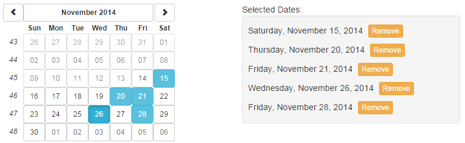

gm.datepickerMultiSelect
========================

gm.datepickerMultiSelect is an AngularJS module that extends UI Bootstrap's Datepicker directive to allow for multiple date selections.

##Install from Bower

		$ bower install gm.datepicker-multi-select --save

##Usage

Once the script is included in your html file, simply include the module in your app:

    angular.module('myApp', ['ui.bootstrap', 'gm.datepickerMultiSelect']);

And use the included 'multiSelect' directive thusly:

    <uib-datepicker ng-model='activeDate' multi-select='selectedDates'></uib-datepicker>

The directive binds an array holding any dates selected in the Datepicker to the specified property on the controller (or its scope).

Click a selected date to de-select it.

Tested in
 * AngularJS 1.2.25 and UI Bootstrap 0.11.0
 * AngularJS 1.3.1 and UI Bootstrap 0.11.0
 * AngularJS 1.4.7 and UI Bootstrap 0.14.1
 
This directive will **not** work properly with UI Bootstrap 0.10.

NOTE: Selected dates are stored as an array of time values, not date objects. Any time values pushed into the multiSelect array programmatically must correspond to midnight on the desired date. This can be done using the Date object's "setHours" function, which conveniently returns a time value. For example, the following code would select today's date:

    selectedDates.push(new Date().setHours(0, 0, 0, 0));

##Issues

Version 1.0.8 of this module is not compatible with the (uib-)datepicker-popup directive. If you need to use it, please use v1.0.7.

##Date Ranges

You can change the selection mode from individual dates to a date range by setting the select-range attribute to a truthy value or expression (that isn't a string equal to "false"):

		<uib-datepicker ng-model='activeDate' multi-select='selectedDates' select-range='true'></uib-datepicker>

After selecting a range, clicking a new date will reset the selection.

##Demo

<a href='http://plnkr.co/iVSdXt' target='_blank'>View demo on Plunker</a>

Screenshot:

